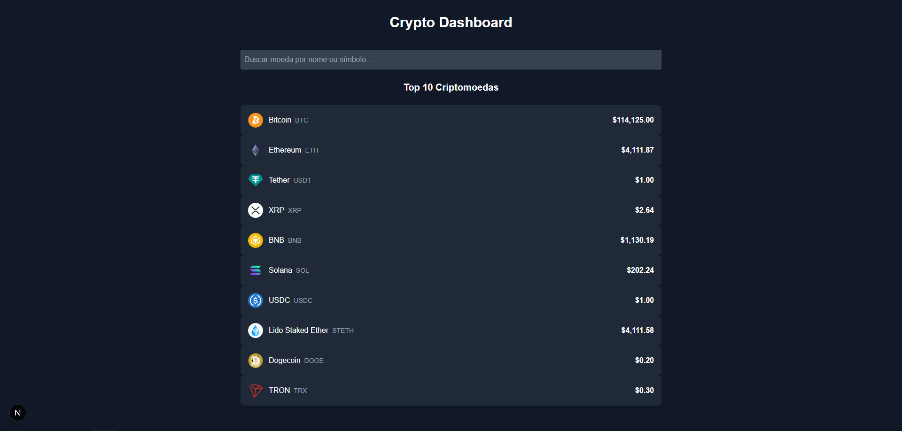

# 📈 Crypto Dashboard - Next.js

 
## 🌟 Visão Geral

O Crypto Dashboard é uma aplicação web desenvolvida com Next.js (App Router) que consome a API pública da CoinGecko para exibir informações atualizadas sobre criptomoedas. O projeto demonstra a busca de dados de APIs externas, gerenciamento de estado no React e a criação de interfaces dinâmicas e responsivas com Tailwind CSS.

**[➡️ Acesse a versão ao vivo aqui!](https://seu-link-do-vercel-crypto.com)** *(Substitua este link após o deploy)*

---

## ✨ Funcionalidades Principais

* **Lista Dinâmica:** Exibe as 10 principais criptomoedas por capitalização de mercado.
* **Busca Instantânea:** Filtra a lista em tempo real conforme o usuário digita o nome ou símbolo da moeda.
* **Página de Detalhes:** Rota dinâmica (`/coin/[id]`) que busca e exibe informações detalhadas sobre uma moeda específica (preço, capitalização, volume, descrição, etc.).
* **Interface Responsiva:** Layout adaptado para diferentes tamanhos de tela.
* **Tratamento de Loading/Erro:** Feedback visual claro para o usuário durante a busca de dados ou em caso de falha.

---

## 🛠️ Tecnologias Utilizadas

* **Framework:** [Next.js](https://nextjs.org/) (App Router)
* **Linguagem:** JavaScript
* **Estilização:** [Tailwind CSS](https://tailwindcss.com/) (v3)
* **Plugin Tailwind:** [@tailwindcss/typography](https://tailwindcss.com/docs/typography-plugin) (para estilizar HTML da descrição)
* **Busca de Dados:** `fetch` API nativa
* **API Externa:** [CoinGecko API](https://www.coingecko.com/pt/api/documentation) (Plano Gratuito)

[](https://skillicons.dev)

---

## 📸 Screenshot


---

## 🚀 Como Rodar Localmente

1.  **Clone o repositório:**
    ```bash
    git clone [https://github.com/tharcio09/crypto-dashboard.git](https://github.com/tharcio09/crypto-dashboard.git) # Substitua pela URL correta
    cd crypto-dashboard
    ```

2.  **Instale as dependências:**
    ```bash
    npm install
    ```

3.  **Inicie o servidor de desenvolvimento:**
    ```bash
    npm run dev
    ```

4.  Acesse [http://localhost:3000](http://localhost:3000) no seu navegador.

*(Nota: O projeto utiliza a API pública da CoinGecko, que possui limites de taxa. Em desenvolvimento intensivo, a busca de dados pode falhar temporariamente.)*

---

## 📫 Contato

**Tharcio Santos**

* [LinkedIn](https://www.linkedin.com/in/tharcio-santos/)
* [Email](mailto:tharciosantos09@gmail.com)

*(Substitua pelos seus links)*
